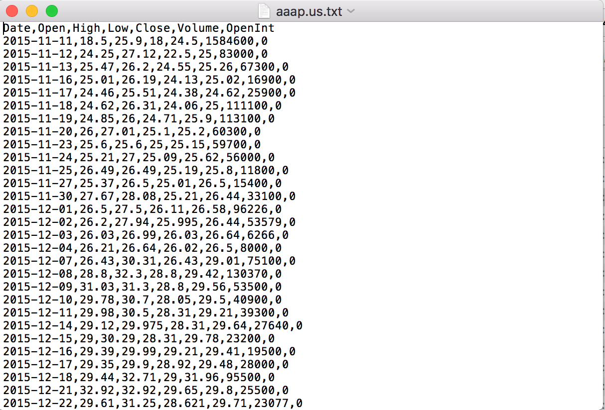
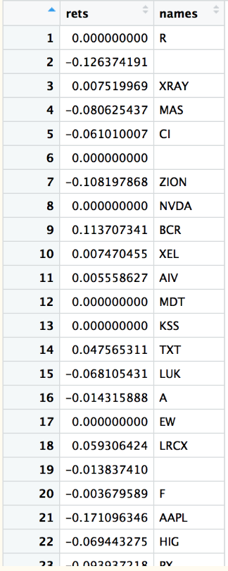

```{r setup, include=FALSE}
knitr::opts_chunk$set(echo = TRUE)
```

### Introduction
In this projected we calculated the risk of a stock investment portfolio. The question we attempted to answer is the following: ‘How accurately would we be able to predict both gains and losses of our randomly chosen stock portfolios, given what we know from our STAT 428 methods?

We have a stock market data set that spans the years 2005 to 2017, from Kaggle. This data set contains the following predictors/variables: Date, Open, High, Low, Close, Volume, OpenInt (open interest) of each stock from NYSE, NASDAQ, and NSYE MKT. Additionally, the prices were adjusted for both dividends and splits. Last, we calculated the return by conducting a “(Close1-Close2)/Close1” for each month or year’s given return.

From this data, we randomly chose a portfolio of 80 stocks, where each stock had a data point for that month or year. Portfolios of stocks are essentially a grouping of financial assets – in this case, groups of stocks comprised of a single portfolio. We began with Random Number Generation (RNG) and Monte Carlo methods to generate returns and then proceeded to find the distribution of those generated returns. Finally, we used that distribution to predict gains and losses (that is, our returns) for future market conditions of the portfolios.

\

### Methods 
\
**Data Processing**
\
As stated earlier, our dataset contains all the stock market data from the years 2005 to 2017. Although this is a lot of good data, for us it was an indicator that some companies had been dissolved and new ones emerged. Each text file contains the following variables: Date, Open, High, Low, Close, Volume, and Open Interest of any given stock on any given day. For our analysis, we only needed the Close Price in order to calculate returns, so we removed all other variables.

We decided to start with March 1st, 2005 – April 1st, 2005. This is why we created a parser that would pick out 80 random stocks and their respective Close Prices on March 1st, 2005, subtracted by the Close Price on April 1st, 2005, and then and divided by the Close Price on March 1st, 2005 to obtain a return. Below we have a picture example of the text file of Advanced Auto Parts’ stock information (Figure 1). The parser also added the name of the company to each value, although at times, this information was challenging to obtain. 




It is important to note here that it was not necessary for our analysis, so it did not affect our results or predictions. Our final data set after processing is shown below (Figure 2).





**Group 1 Methods: Bayesian Analysis**

        	To begin by describing our prior distribution, we conducted a literature review and found that picking a random portfolio of stocks would give us a Normal Distribution. We thought it would be best to define our prior distribution as the Normal Distribution. Initially, we planned to define our prior distribution as Normal-Inverse Gamma. Unfortunately, it complicated our model quite significantly.  Thus, we decided to keep our variance constant.
        	
We also graphed what our data would look like. This is shown below in Figure 3. This allowed us to create our likelihood distribution against the Normal Distribution as well. Another important factor in this was that we had to add a constant C value in order to adjust our values, so that they made sense as practical return values.


```{r, echo=FALSE}
library(stringr)
library(readr)
library(dplyr)
```

### Read in Data
```{r, echo=FALSE}

set.seed(222)

readInStocks = function(n, date1 = "2015") {
  # Gives n number of random stocks from the S & P 500
  # 
  # Args:
  #   n: Number of random stocks to be read
  # 
  # Returns:
  #   List of dataframes with each stock's close value for each day
  
  snp = read.csv("Stocks.csv")
  
  #nums = sample(1:500, n)
  #arr100 = snp$Symbol[nums]
  #sec100 = snp$Sector[nums]
  
   dateN = date1 %>% as.character() %>% substring(1,4) %>% as.numeric()
   print(dateN)
  
  #array = arr100
  
  
  nums = c()
  
  
  stocks_2005 = list()
  
  i = 1
  while (i <= n) {
  #for (i in 1:n) {

    num = sample(1:500, 1)
    
     while (num %in% nums) {
       num = sample(1:500, 1)
       
       if (length(nums) > n) {
         return(-1)
       }
     }
    
    arr = snp$Symbol[num]
    
    # print("num is")
    # print(num)
    # print("i is")
    # print(i)
    
    dir = c("../Stocks/", as.character(arr), ".us.txt")
    
    dir2 = str_c(dir, collapse = "")
    #print(dir2)
    if(!file.exists(dir2)) {
      next
    }
    stock = read.table(dir2, sep=",", header=TRUE)
    stock[3] <- NULL
    stock[3] <- NULL
    stock[4] <- NULL
    stock[4] <- NULL
    stock[2] <- NULL
  
    stock$name <- arr
    
    

    
    beg = stock$Date[1] %>% as.character() %>% substring(1,4) %>% as.numeric()
    end = stock$Date[length(stock$Date)] %>% as.character() %>% substring(1,4) %>% as.numeric()
    
    
    if (beg > dateN || end < dateN) {
      
      i = i-1
      
      #print("Enters here:")
      
      #nums = sample(1:500, n)
      #arr100 = snp$Symbol[nums]
      #sec100 = snp$Sector[nums]
    }
    else {
      stocks_2005[[i]] <- stock
    }
    
    
    i = i+1
  }

  return(stocks_2005)

}


#readInStocks(500) -> vals


```


### Read Difference
```{r, echo=FALSE}

closeDiffPct = function(n, firstDate, secondDate, stocks_2005) {
  # Gives difference in close values from firstDate to secondDate
  # 
  # Args:
  #   n: Number of stocks to be read that are in stocks_2005
  #   firstDate: The first Date
  #   seconDate: The second Date
  #   stocks_2005: List of stock dataframes
  # 
  # Returns:
  #   A dataframe with the differences in percentage of close values, 
  #   with the stock name next to it
  
  
  rets = numeric(n)
  names = c()
  
  
  
  for (i in 1:n) {
     stock_df = stocks_2005[[i]]
     stock_df$Date = as.character(stock_df$Date)
     firstN = which(stock_df$Date == firstDate)
     secondN = which(stock_df$Date == secondDate)
     #print(firstN)
     #print(secondN)
     
     if ((is.integer(firstN) && length(firstN) == 0) | 
         (is.integer(secondN) && length(secondN) == 0)) {
       
       names = c("", names)
       next
     }
  
     stock_close_03 <- stock_df[firstN,]$Close 
     stock_close_04 <- stock_df[secondN,]$Close
     s_2005 <- (stock_close_04-stock_close_03)/stock_close_03
     
     #print(s_2005)
     rets[i] = s_2005
     names = c(stock_df$name[1], names)
  }
  
   return2005 = data.frame(rets, names)
   return2005
   
   return(return2005)
    
}

```


### Run Code
```{r, echo=FALSE}

set.seed(679)

#Run code
 stocks = readInStocks(250)
 readValues = closeDiffPct(250, "2005-03-01", "2005-06-01", stocks)
 hist(readValues$rets)
 mean(readValues$rets)
 var(readValues$rets)

```

###Graph Data
```{r, echo=FALSE}

hist(readValues$rets)
mean(readValues$rets)
var(readValues$rets)

```
